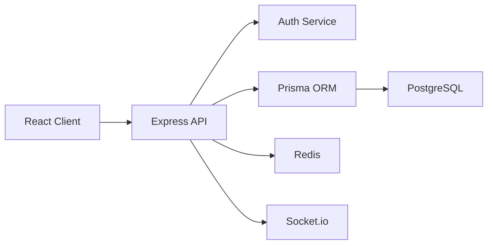

# Architecture

SkillForge AI is organized as a SaaS monorepo with independent client and server workspaces.

## Runtime View

## Backend Layers

- Routes expose versioned HTTP contracts under `/api/v1`.
- Controllers validate request bodies and shape HTTP responses.
- Services hold business workflows such as tenant registration, login, refresh, and logout.
- Middleware handles authentication, authorization, error responses, CORS, rate limiting, and security headers.
- Prisma models define tenant, user, session, and audit data.

## Frontend Layers

- The dashboard shell is the first operational screen.
- The design base uses responsive CSS, accessible controls, stable grid dimensions, and utility-friendly class names.
- Future Phase 2 modules should live under feature folders for CRM, HR, inventory, finance, sales, and reports.

## Multi-Tenant Foundation

Every company is a tenant. Users may belong to one company and receive a role. Future modules should carry `companyId` on tenant-owned records and index tenant access paths.
