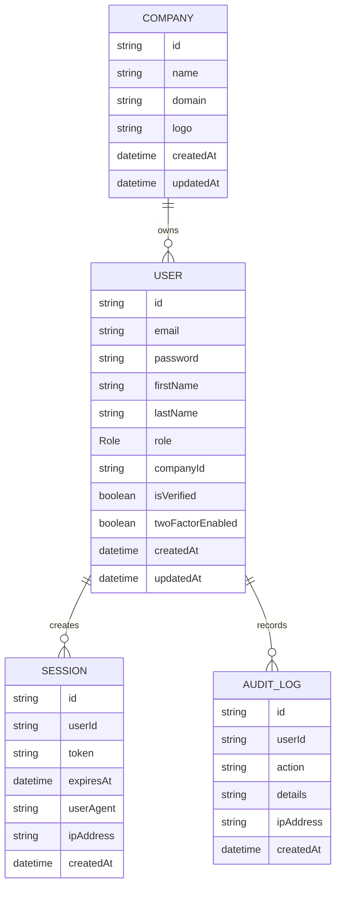

# Database Documentation

The Phase 1 schema is intentionally small and normalized so later ERP modules can attach to tenant-owned companies.

## Models

- `Company`: tenant record with name, optional domain, optional logo, users, and timestamps.
- `User`: authenticated user with email, password hash, role, verification flags, company relation, sessions, and audit logs.
- `Session`: persisted access-token session with expiry, user agent, and IP metadata.
- `AuditLog`: security and operational event trail.

## Roles

`SUPER_ADMIN`, `COMPANY_OWNER`, `MANAGER`, `EMPLOYEE`, `CUSTOMER`, `VENDOR`, `HR`, `ACCOUNTANT`, `SALES_EXECUTIVE`, `SUPPORT_EXECUTIVE`

## Indexes

- `User.email`
- `User.companyId`
- `Session.userId`
- `Session.token`
- `AuditLog.userId`

## ER Diagram

